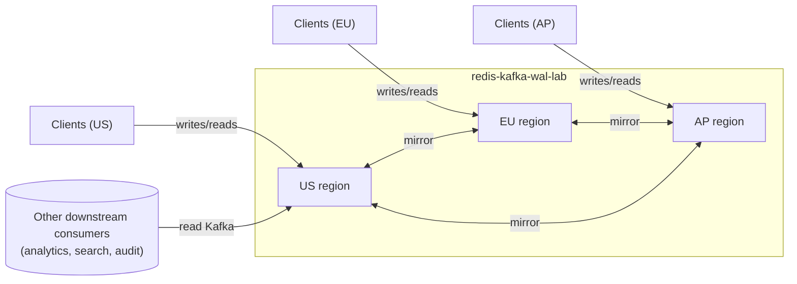
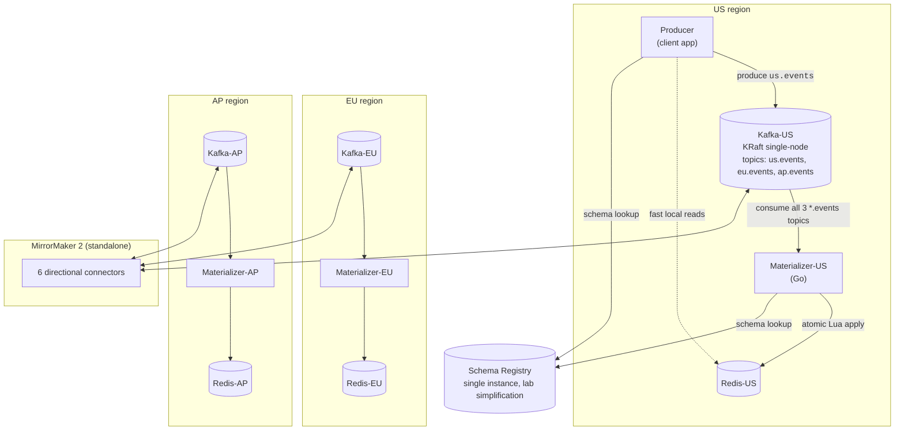
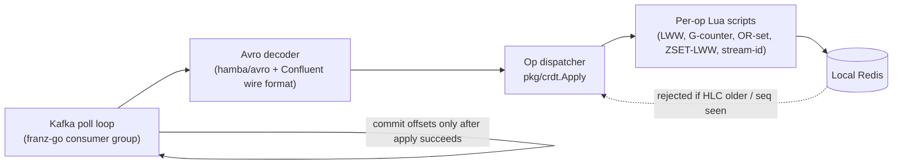

# Architecture

This document is the system-level view. For event-flow detail see
[`docs/architecture.md`](docs/architecture.md), for the math behind
conflict resolution see [`docs/conflict-resolution.md`](docs/conflict-resolution.md),
and for the discrete decisions and their rationale see
[`docs/adr/`](docs/adr/).

## Goal

A geo-distributed key/value system where:

- Every region has a **fast local Redis** for reads and writes.
- Every write is **durably persisted to Kafka** before it propagates.
- The system is **active-active**: every region accepts writes; nothing
  fails over.
- Recovery from a wiped Redis is a deterministic **replay from the
  Kafka log**, not a peer copy.

This sits between two more-familiar designs:

- **Redis Enterprise Active-Active**: Redis is the system; replication
  is internal. Lower latency, less ops surface, licensed.
- **Single-region Redis + Kafka CDC**: cheap, no real geo story.

This lab takes Kafka-as-source-of-truth and pairs it with per-region
Redis materializations, getting active-active geo behavior with
open-source components and a Kafka log usable by other consumers
(analytics, search, audit).

## System context (C4 level 1)



Clients in each region talk to their nearest region. Writes hit Kafka
first, then materialize into the local Redis. Reads come from local
Redis. The Kafka log is also available to *other* consumers — that
optionality is one of the main reasons to choose this design over a
managed Redis active-active product.

## Container view (C4 level 2)



Per-region: Kafka, Redis, materializer. Across-region: MM2. Once at
boot: producer/consumer fetch the Avro schema from a single Schema
Registry.

## Component view: the materializer (C4 level 3)



The dispatcher is a switch on `Op`; each handler is a single Redis
EVALSHA. Atomicity is delegated to Lua: the script reads the meta
sidecar, decides whether to apply, and writes both the value and the
new meta in one Redis-side step.

## Data model

### Event (Avro union)

```text
Event {
  event_id:      string (ULID)
  origin_region: enum {us, eu, ap}
  hlc:           {physical_ms, logical, region}    -- Hybrid Logical Clock
  key:           string                            -- Redis key
  op:            enum {SET, DEL, INCR, SADD, SREM, ZADD, XADD}
  payload:       union<null, SetVal, DelVal, IncrVal, SAddVal, SRemVal, ZAddVal, XAddVal>
}
```

### Redis key shapes

| User key | Sidecars maintained by the materializer |
| --- | --- |
| `<key>` (string) | `<key>:meta` (last-applied HLC for SET/DEL) |
| `<key>` (counter) | `<key>:seq:us`, `<key>:seq:eu`, `<key>:seq:ap` |
| `<key>` (set) | `<key>:smeta` (per-member packed HLC) |
| `<key>` (zset) | `<key>:zmeta` (per-member packed HLC) |
| `<key>` (stream) | none — entry id IS the HLC |

### Topic shape

- Three topics per Kafka cluster: `us.events`, `eu.events`, `ap.events`.
- Partitions: 12 per topic (uniform across all clusters so a key lands
  on the same partition number everywhere — useful for debugging).
- Partition key: the Redis key. Per-key per-origin order is preserved
  by Kafka.

## Cross-cutting concerns

### Ordering and consistency

- **Strong eventual consistency.** All regions converge once events
  are delivered.
- **Per-key per-origin total order.** `us.events` for key K is read in
  produce order on every region.
- **No total order across origins.** That's what HLC + LWW handle.

See [`docs/consistency.md`](docs/consistency.md).

### Failure modes

- Region down: surviving regions continue; MM2 catches the recovered
  region up; HLC-gated apply means late events lose to anything newer
  that arrived during the outage.
- Network partition between regions: each side accepts local writes;
  reconciles after heal.
- Consumer crash: at-least-once with idempotent handlers; offsets only
  committed on apply success.
- Redis loss: rebuild from Kafka (`scripts/replay.sh`).
- Schema Registry loss: existing producers/consumers cached the schema
  at boot, keep working; new instances fail to start.

See [`docs/RUNBOOK.md`](docs/RUNBOOK.md) for the operational playbook
and [`docs/failure-modes.md`](docs/failure-modes.md) for the analysis.

### Security

The lab uses **PLAINTEXT** Kafka, **no auth** Redis, **no TLS** anywhere,
and a Schema Registry with no ACLs. This is intentional for a lab.
Production needs:

- mTLS or SASL/SCRAM on Kafka inter-broker and client traffic.
- Redis ACLs and TLS.
- Schema Registry behind authentication.
- Network segmentation between client traffic and replication traffic
  (separate listeners in Kafka).

See [`docs/adr/0009-pure-go-stack.md`](docs/adr/0009-pure-go-stack.md)
and [`ROADMAP.md`](ROADMAP.md) for what's queued.

### Schema evolution

Schemas are registered with `BACKWARD` compatibility. Adding a new op
or payload variant: append-only edit to `schemas/event.avsc`,
re-register, deploy consumers first, then producers.

Removing or renaming a field requires `FORWARD_TRANSITIVE` plus a
multi-step deploy and is out of scope.

## Trade-off summary

| Choice | Pro | Con |
| --- | --- | --- |
| Kafka as source of truth | Replay, audit, downstream consumers | Extra hops on the write path |
| Per-region Kafka + MM2 | No global SPOF; local writes | More clusters to operate |
| Active-active CRDT-style | No leader election, region-local writes | Conflicts resolved by LWW, not human intent |
| HLC ordering | Total order under skew without vector clock blow-up | Region tag breaks ties, not real causality |
| Single Schema Registry (lab) | Simple to reason about | One-region SPOF; production needs Schema Linking |
| Avro + Confluent wire format | Production-realistic | More moving parts than JSON |
| Pure-Go stack (franz-go) | No CGo; reproducible builds | Smaller community than confluent-kafka-go |

Each row links (in the ADRs) to the alternatives considered and why
they were rejected.
